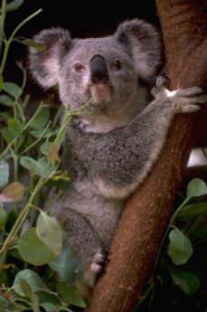
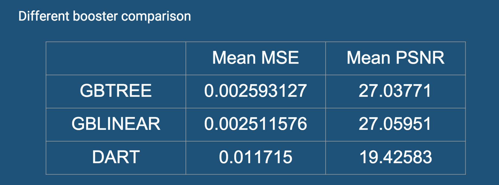

# Project: Can you unscramble a blurry image? 
   (Low Rsesolution)  (Baseline Recovered)
   (XGB Recovered)      (High Resolution)            

### [Full Project Description](doc/project3_desc.md)

Term: Spring 2019

+ Team ##
+ Team members
	+ Yuting He
	+ Seungwook Han
	+ Shengwei Huang
	+ Mengran Xia
	+ Hongye Jiang

+ Project summary: In this project, we created a classification engine for enhance the resolution of images. We created two versions: baseline model using gbm and an improved model using xgboost (with tuned parameters). The baseline model is in /doc/main.Rmd and the improved model is in /doc/main.xgb.Rmd. We also considered using deep learning method and tested CNN model. We used depth = 11 for the baseline model, and trained three Booster methods: GBtree, GBlinear and Dart. These models were than each ran through cross validation with the tuning of alpha and lambda. Based on the performance, GBlinear has a much better performance with more efficient running time. 
 
we eventually decided to choose 8 neighbors feature extracting and XGboost linear model with depth of 11 to predict the high resolution pircture from low resolution pictures.

+ Notes: In order to run main.Rmd or main.xgb.Rmd, some basic paths that need to be modified or inspected before running the document are the setting the working directory in line 33, training directory in line 44 (if you need to change the training images), and testing directory in line 181 (if you need to change the testing images).

**Contribution statement**:

*Seungwook Han*
* Brainstormed and researched on deep learning-based models that we can use for the super resolution task
* Tried to implement a deep CNN model for the super resolution task (https://github.com/jiny2001/dcscn-super-resolution/)
* Explored and implemented different options for improving the xgboost model by changing and optimizing the parameters (max_depth, nrounds, booster, etc)
* Researched new datasets that we could use as a validation set to ensure the performance of our improved model

*Shengwei Huang*
* Constructed the basic XGBoost model (train function, test function, cross validation fucntion)
* Performed the cross validation for all possible parameters: [GBTree booster:max_depth,eta / GBLinear booster:alpha,lambda] (together with Seungwook Han)
* Chose the best pair of tuning parameters which can minimize the mean squared error / maximize the psnr or minimize the training time and superResolution time
* Explored more (50) random images to do the testing so that we can see how our model would perform when recovering other types of images

*Yuting He*
* Updated baseline model (main, super resolution, test, train), trained baseline model to get fit_train, tested baseline model to get mse, psnr and running time.
* Constructed the XGBoost model (main.xgb, superresolution.xgb) and tuned parameters. [GBTree booster:max_depth] (together with Shengwei Huang)
* Collect the results from different models and summarized them to make presentation powerpoint.

*Hongye Jiang*
* Performed the baseline model,including the feature of images and Super-resolution imaging.
* Tested different parameters and manipulated feature selection to improve the running time of the model. 

*Mengran Xia*
* Brainstormed together with the team on the best training model for image resolution recovery. 
* Performed the XGBoost model (train function, test function, cross validation fucntion) and tuned parameters on depth to get mse, psnr and running time. 
* Organized the Github Directory and finished the writeup of Read Me. 

Following [suggestions](http://nicercode.github.io/blog/2013-04-05-projects/) by [RICH FITZJOHN](http://nicercode.github.io/about/#Team) (@richfitz). This folder is orgarnized as follows.

```
proj/
├── lib/
├── data/
├── doc/
├── figs/
└── output/
```

Please see each subfolder for a README file.
